<div align="center">

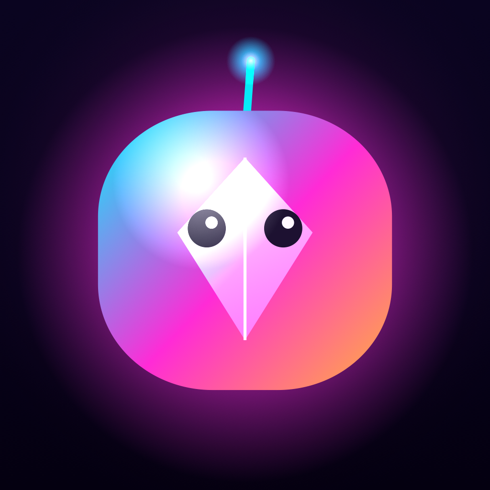

# PRISM RUSH ⚡ — Native iOS

**A neon, three-world, three-lane hyperspeed endless runner for iPhone.**
Swipe lanes, jump, slide. Chain gem streaks, thread near-misses, dodge moving walls.
Every mesh, every sound, and even the app icon is **generated in code** — zero hand-authored binary
assets (the lone icon PNG is generated by `Tools/gen_icon.swift`).

Built with **Swift 6 · SwiftUI · RealityKit**, ground-up by [Claude Code](https://claude.com/claude-code).

</div>

---

## What it is

Prism Rush is a native port of a shipped Three.js web prototype, rebuilt as a real iOS game. A tiny
glowing slime rides a three-lane track that accelerates the longer you survive. Collect gems to build a
streak multiplier (×1 → ×5), squeeze past tall blocks for **CLOSE** bonuses, slide under bars for
**SLICK** ones, and grab Shield / Magnet pickups. Three world families — Neon Metropolis, Crystal
Caverns, Solar Sands — crossfade around you every 800 m, and each successive cycle visibly
*evolves* them: the palette hue-rotates, the atmosphere deepens, and the synthwave bed thickens, so
world 7 reads as a hotter, denser take on its family rather than the same art again.

The interesting part isn't the game; it's how it's built. The entire simulation is a **pure,
deterministic, renderer-agnostic Swift core** driven by a fixed 1/120 s timestep. Because a single seed
fully determines a run, the spawner is **provably fair**: an automated bot clears 6,000 m on 200 distinct
seeds with **zero unavoidable deaths**, enforced as a unit test.

---

## Walkthrough

Every screenshot below is the **actual app running on an iPhone 17 Pro simulator**, driven end-to-end by
the in-engine autopilot (the same bot used in the solvability tests) — real frames, real score, real
collisions.

<table>
<tr>
<td align="center">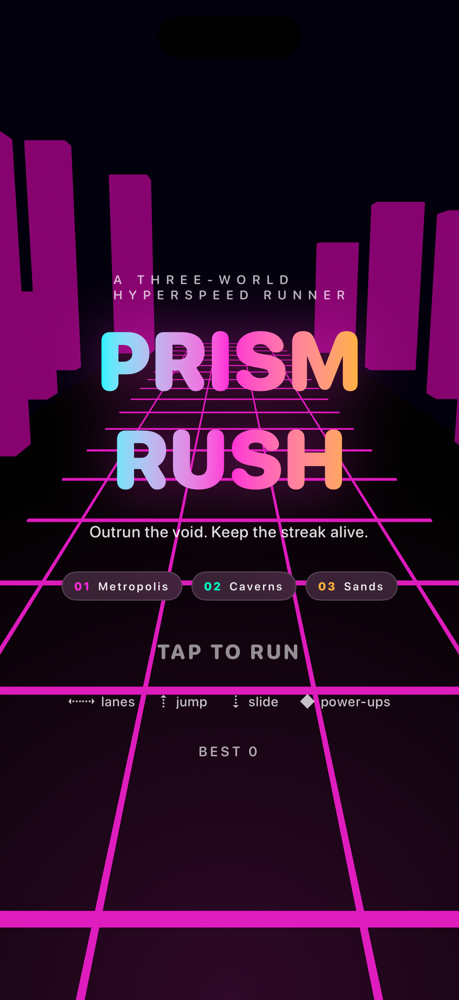<br><sub><b>1 · Title</b><br>Neon skyline + world select</sub></td>
<td align="center">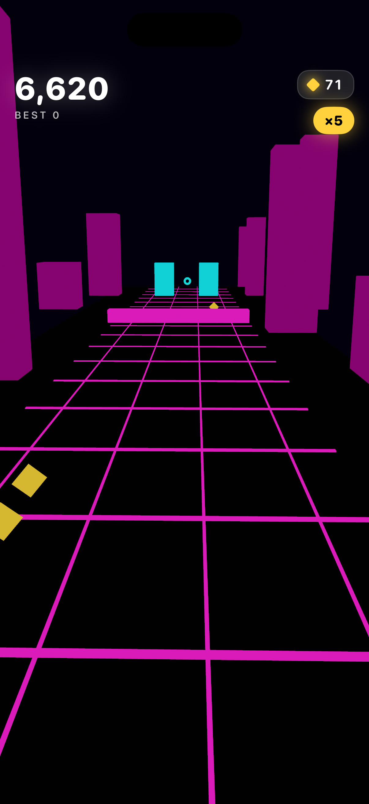<br><sub><b>2 · Neon Metropolis</b><br>Magenta grid, emissive towers</sub></td>
<td align="center">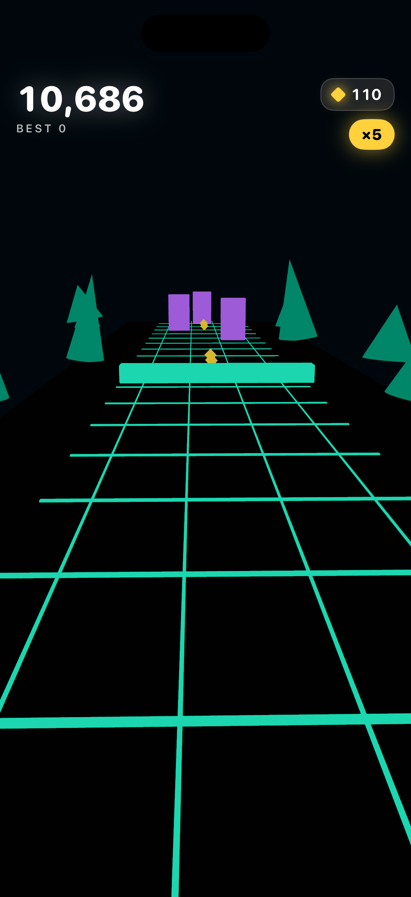<br><sub><b>3 · Crystal Caverns</b><br>World banner + crossfade + CLOSE near-miss</sub></td>
</tr>
<tr>
<td align="center">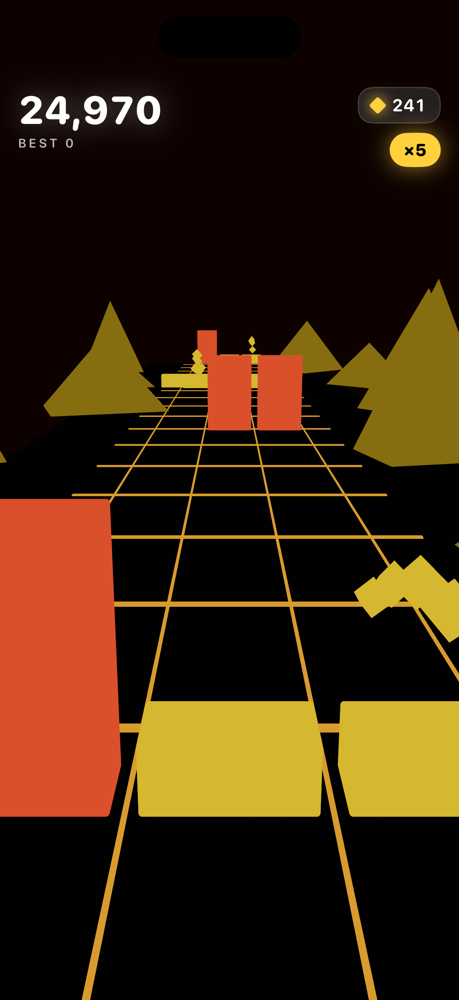<br><sub><b>4 · Solar Sands</b><br>Amber dunes + pyramids (24,970)</sub></td>
<td align="center">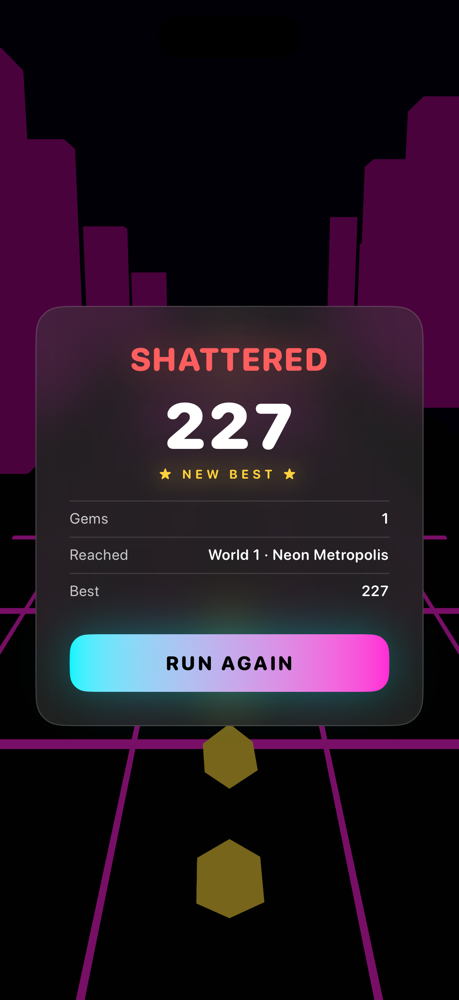<br><sub><b>5 · Shatter</b><br>Score freezes, new best</sub></td>
<td align="center"><br><sub><b>Icon</b><br>1024² Core Graphics, no text</sub></td>
</tr>
</table>

> The three world families **crossfade around the player** every 800 m and **evolve each cycle**
> (hue rotation, deepening atmosphere, denser sky, thicker music — a pure function of the absolute
> world ordinal) — each with its own palette, obstacle tints, and decor silhouette, all from the
> same code.

---

## Free-to-play systems

A full meta-game on top of the runner — currency, a shop, customizable characters, world
checkpoints, secure accounts, and friends competition — driven by an `@Observable` `ProfileStore`
(persists to UserDefaults and **iCloud** key-value sync, so saves follow you across devices).

<table>
<tr>
<td align="center">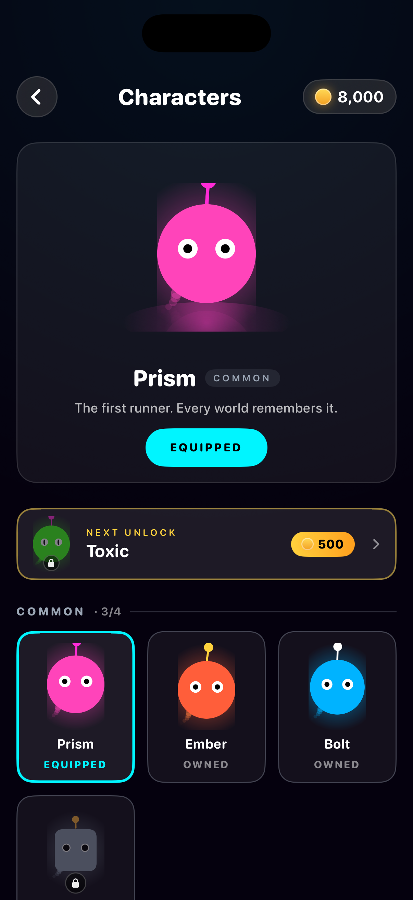<br><sub><b>Characters</b><br>Buy/equip 24 procedural characters (rarity tiers, coin/level/IAP unlocks)</sub></td>
<td align="center">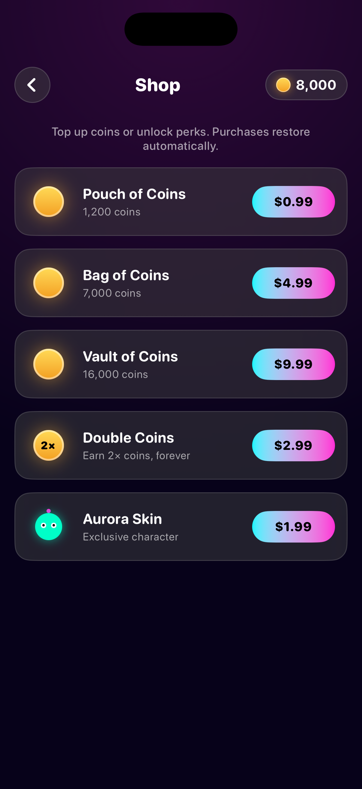<br><sub><b>Shop</b><br>StoreKit 2 IAP — coin packs, Double Coins, premium skin</sub></td>
<td align="center">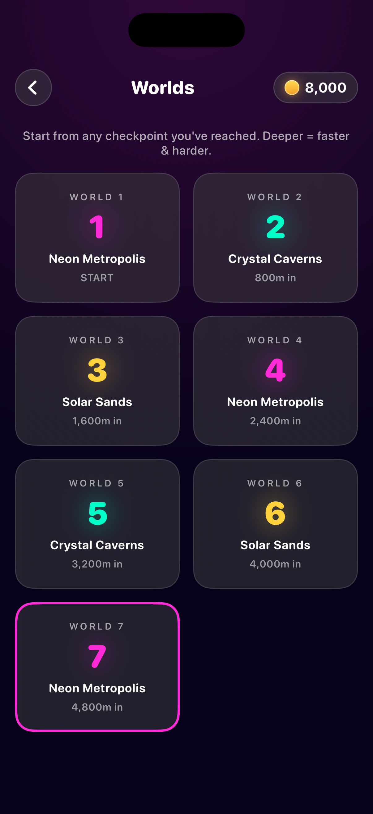<br><sub><b>Worlds</b><br>Checkpoint start from any reached world</sub></td>
</tr>
<tr>
<td align="center">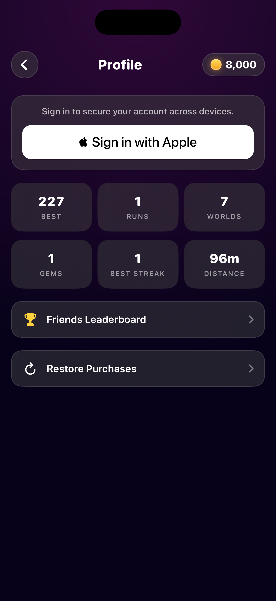<br><sub><b>Profile</b><br>Sign in with Apple · stats · friends leaderboard</sub></td>
<td align="center">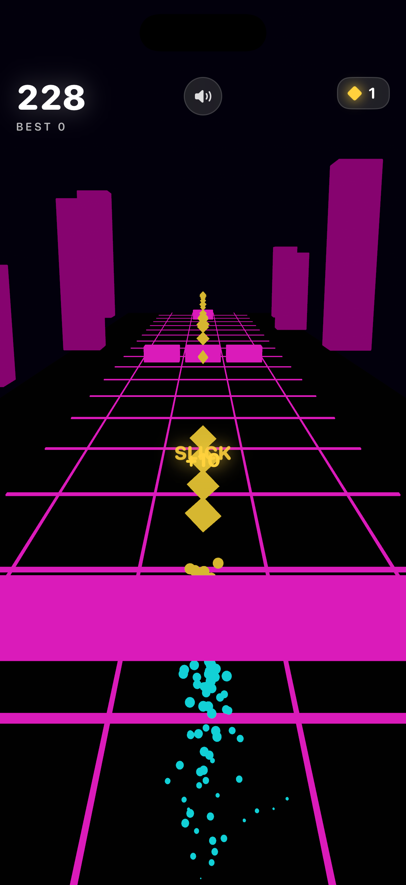<br><sub><b>Slide</b><br>Pancake-lean pose + ground dust + SLICK bonus</sub></td>
<td valign="center"><sub>• Coins earned per run (gems + distance, ×2 with Double Coins)<br>• Game Center leaderboard `prismrush.best`<br>• Sign in with Apple + iCloud save sync<br>• Data-driven catalogs (skins / IAP) — easy to extend<br>• 1024² code-generated app icon, zero asset files</sub></td>
</tr>
</table>

> **Developer-ready, not yet live:** all of this is fully coded, built and tested. *Activating* real
> money and accounts needs your Apple Developer account — see **Shipping** below.

---

## v1.1 — critique-driven overhaul

A multi-agent "hater-critic" review ([`reports/CRITIQUE.md`](reports/CRITIQUE.md)) audited every layer,
confirmed bugs from the actual code, and drove four gameplay-first rounds — each fix **proven by a real
XCUITest that taps the buttons**, not just a screenshot (the gap that let the original bugs ship).

<table>
<tr>
<td align="center">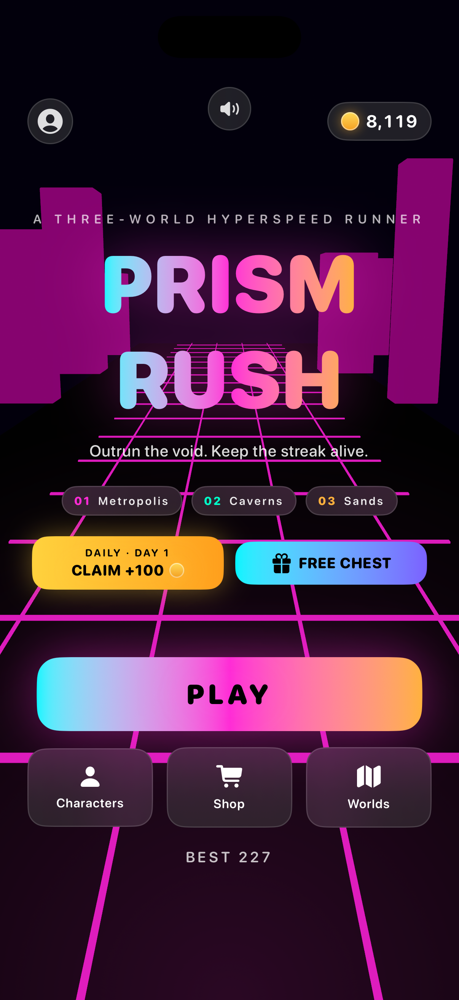<br><sub><b>Retention rewards</b><br>Streak-tiered daily bonus + free chest every 30 min (live countdown)</sub></td>
<td align="center">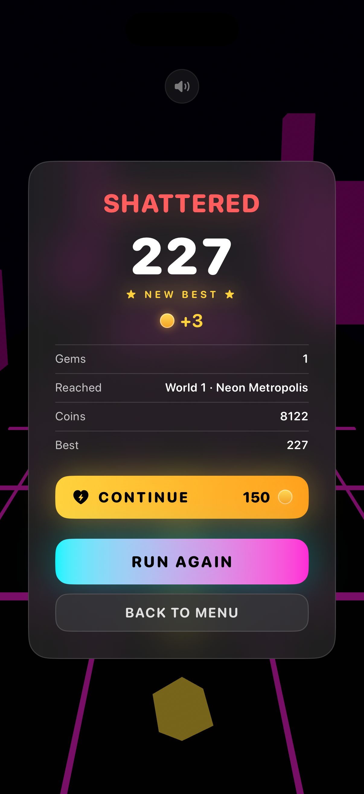<br><sub><b>Continue &amp; exits</b><br>Revive-for-coins, RUN AGAIN, and the BACK TO MENU that was missing</sub></td>
</tr>
</table>

**Fixed &amp; verified:** back-to-menu after death · live character equip · Sign in with Apple (entitlement +
observation + error surfacing) · a dramatically more visible slide · **World 2 no longer has the unfair
moving walls** (now deterministic, slower, and gated until you've acclimated) · no checkpoint speed-cliff ·
wider jump buffer.
**Added:** pause (+ auto-pause on backgrounding) · daily rewards · login streaks · timed chests ·
revive-for-coins · much bigger particles/shake/flash · a ~6,000-allocs/sec render fix.
**Tested:** 38 unit + 6 XCUITest interaction tests, all green.

---

## v1.2 — Fable 5 multi-agent overhaul

A coordinated multi-agent overhaul: six specialized agents (tooling, core, render, audio,
meta, integration/wiring) each swept their layer in parallel, handing off through written contracts
([`reports/AGENT_*.md`](reports/)), with a final adversarial QA pass over the entire diff
([`reports/QA.md`](reports/QA.md)) — including a 500-seed × 6,000 m bot soak with **zero deaths**.

**Test harness anywhere:** the deterministic layers (Core sim, economy, missions, synth DSP) now also
build as a SwiftPM package (`Package.swift`), so the full **89-test** suite — including the 200-seed
solvability bot — runs on Linux, and a GitHub Actions workflow runs it on every push/PR. No Mac needed
to keep the core honest.

**Bug-fix sweep (probe-confirmed, regression-tested):** the revive economy exploit (dying after a
continue re-paid the whole run's coins — now every payout is a per-death *delta*, `totalRuns` counts
once) · a NaN `dt` guard in `GameCore.advance` (a single NaN wedged the accumulator forever) · world
decor never resetting between runs · AVAudioSession resilience (interruptions, route changes, and
config changes now recover the engine and re-anchor the music instead of going silent for the
session) · revive score leak · shield same-tick double-hit · near-miss band paying for standing still.

**New content:** **Coin Doubler** (10 s, gems pay double coins — never double skill stats) ·
**Chrono** slow-mo (5 s at 0.65×, dodge windows stretch — the bot proves runs stay solvable with it
live) · **Split Bar** — a 12th obstacle pattern covering 2 of 3 lanes (steer to the gap *or* slide) ·
**missions & tiered achievements** (3 rotating daily slots, per-run challenges, claim-once engine,
clock-exploit-proof) · a **daily challenge** — everyone worldwide plays the same seeded track each UTC
day, ranked on the recurring `prismrush.daily` Game Center board · **settings** (music/SFX volume,
haptics, reduce flashing) · a swipeable **how-to-play tutorial** on first run · a full **game-over
overhaul** (count-up score, run stats grid, exact coin breakdown, NEW BEST vs "m TO GO", revive
states).

**Performance:** steady-state rendering is now material-allocation-free (material *instances* rebuilt
only on palette-key change during crossfades; particle materials cached; time-based emission
identical at 60/120 Hz — a small bounded per-frame `[material]` array literal per visible entity and
one CoW snapshot copy remain) and every SFX renders once into a cached buffer instead of being
re-synthesized per play.

**Accessibility:** Dynamic Type (`@ScaledMetric` copy), VoiceOver labels across missions/shop/
challenge/stats, a reduce-flashing setting (death flash ×0.15), and live Reduce Motion gating for
shake/FOV/speed lines.

> **Honesty note:** everything above is proven on Linux (89/89 unit tests + parse checks of every
> iOS file), but Linux cannot type-check or run UIKit/RealityKit/SwiftUI. The UI layers still need
> **one Mac build + the visual/audio pass** — the exact checklist lives in
> [`reports/AGENT_wiring.md`](reports/AGENT_wiring.md) §MAC VERIFICATION (and condensed in
> [`docs/SHIP_CHECKLIST.md`](docs/SHIP_CHECKLIST.md)).
> *(Resolved in the v1.2 Mac pass: BUILD OK first try, 95/95 green — see `state.md` §A.)*

---

## v1.3 — characters, progression & the fun fix

Owner playtest verdicts drove this one: *"why doesn't my character change?"*, *"I have to jump
then slide mid-air to catch the coins"*, *"too loaded with info"*. A two-stage agent fleet
(4 explorer→designer pipelines → one binding contract, [`reports/design/V13_SPEC.md`](reports/design/V13_SPEC.md),
then 6 implementation waves with strictly disjoint file ownership + 5 adversarial reviewers + a
fixer) shipped, all gates green:

**Characters become the game.** 16 fully procedural characters (24 since v1.4 — zero assets:
body shape/scale, eye & pupil styles, antenna variants, per-skin idle personality) across 4 rarity
tiers. Your pick *stays yours in every world* — every character, **including the free default**,
keeps a constant identity: fixed body colors plus skin-tinted trail, slide dust, landing burst and
death shatter. (Prism, the default, gets a *prismatic shimmer* — a fixed 8-second cyan→magenta→amber
cycle that is identical in every world; v1.3 shipped it as a world-following chameleon, revoked by
owner decree in v1.4.2.) Locked characters show their exact unlock path: coins, **XP levels
3/6/12/25** (3/6/8/12/18/25 since v1.4), achievements, daily-challenge days, or the one IAP.
Animated **idle previews everywhere** (30 Hz Canvas — blink schedules, bob, antenna sway): the menu
hero stage and a stage-and-shelf character select (preview before you commit).

**Progression.** XP per run (distance/gems/near-misses/streak) → **30 levels** with banded coin
grants and character unlocks; XP bar + level-up burst on the death panel, level ring on the menu.
Four new earn loops, still **zero ads**: level-up grants, a weekly mission board (3 big slots per
UTC week), in-run **style coins** for near-miss play, and daily-challenge score tiers.

**The fun fix + 3 new mechanics.** Gem arcs are now laid **on the actual jump parabola**
(speed-aware — 7/7 collectible with one clean jump, no more mid-air slide). **Prism Rings** to
thread at apex (a PERFECT thread pays 12 coins instead of 5) · **Overdrive Pads** (1 s speed surge
in a provably safe runway, double gem pay) · **Flow Surge** (every 3rd near-miss erupts a 10-gem
fountain) —
all proven by the same 200-seed/12,000 m solvability bot with **zero Autopilot changes**, under
`layoutVersion 2` (daily-challenge goldens re-pinned).

**UI reframe.** Menu rebuilt Hero/Verb/Rail/Nav (14 elements → 9, your character front and
center), role-based palette (cyan = tappable, gold = claimable, world colors stay in-game),
type/spacing/radius tokens, a **living Worlds tab** (procedural per-world vignettes, per-world
bests, PLAY FROM HERE), a 4-section Shop that survives StoreKit being offline, an in-run HUD diet
(ghost-chase chip instead of a static BEST, merged gem/mult pill, icon timer rings, flow pips),
and a full clickability audit — every element on screen now leads somewhere.

**Verification (v1.3-era gate):** `swift test -c release` **129/129** (Linux-provable) ·
`./Tools/ci.sh` **137/137** (129 unit + 8 XCUITest) · 4-minute autoplay soak on a wiped profile
(zero crashes, rings/fountains/boosts observed live) · fresh screenshot sweep in
[`reports/shots/v13/`](reports/shots/v13/). *(The gate has since grown — see v1.4 below.)*

---

## v1.4 → v1.4.2 — worlds for sale, an honest shop, and the owner decrees

**v1.4 — the world ladder.** The three worlds become a **12-rung purchasable ladder**: reach a
world once to checkpoint there free, or buy a deeper start outright with coins
(400 → 13,400 per rung, a 59,400-coin total sink — and a reach-credit gate so a purchased start
never farms reach-based rewards). Every world gets its own **procedural sky identity**
(`WorldSky`: ringed planets and dunes, layered skylines with blinking windows and blimps,
stalactites and rotating crystals — pooled, Reduce-Motion-gated, zero assets). The roster grows
**16 → 24** (new XP beats at levels 8 and 18, coin rungs 2,000/3,500/5,000/7,500, a gems
achievement, a 14-day challenge pull), locked skins render as a full-color animated tease instead
of a dark silhouette, and the missions board gets a full overhaul (summary strip, ring cards,
CLAIM ALL).

**v1.4.1 — shop conversion pass.** The catalog goes 5 → 7 products (a one-time **Starter Bundle**
shown only before your first purchase, and a top-end coin crate), with computed value badges that
can't desync from price edits, a **first-purchase +50 % coin bonus** that is paid exactly once
(replay-idempotent grants, iCloud-merge-safe purchase credits), and honest pre-launch states:
before App Store Connect exists the shop shows a quiet "prices shown · App Store setup pending"
footnote — never a red error for a normal situation.

**v1.4.2 — the owner decrees.** Six product decrees now live in `CLAUDE.md` and **override every
design doc** (a character never changes identity with the world; previews never lie; no
broken-looking states; everything leads somewhere; zero ads, no dark patterns; clarity beats
spectacle). A read-only intent audit ([`reports/AUDIT_intent.md`](reports/AUDIT_intent.md)) swept
the shipped app against them and a four-wave fix fleet landed it all: the **Prism chameleon kill**
(the default character followed the world palette through seven mutually-reinforcing surfaces —
now it's a fixed prismatic shimmer, identical in all 12 worlds, with menu previews and the in-run
body sampling the same clock), preview/rig fidelity (antenna colors, per-skin blink cadence, sway
speed, body proportions, trail color visible at the buy moment), state honesty (one canonical
equipped-skin resolver with cloud-merge self-heal; the menu world chip tracks purchases), and a
calmer first run (tutorial gate covers every run entrance, the info X never force-starts a run, a
WORLDS card teaches the 800 m transition, tutorial numbers derive from `Tuning` so a retune can't
strand the copy).

**Verification:** `./Tools/ci.sh` **174/174** (163 unit + 11 XCUITest) · evidence in
[`reports/shots/v14/`](reports/shots/v14/), `v141/`, `v142/` (incl. one autoplay run crossing the
800 m crossfade with Prism's shimmer — never the world accent — on both sides).

---

## v1.4.3 — the worlds evolve (code-review §20)

A strict Opus 4.8 code review ([`CODE_REVIEW.md`](CODE_REVIEW.md), 8.7/10) flagged that the 12-rung
ladder reused three palette families on a `world % 3` loop — so worlds 6/9/12 were the same three
reshuffled. They now **evolve with the absolute world ordinal**: `Theme.evolvedPalette(ordinal:)` is
a pure function that rotates the hue ~49° per cycle (wrapping, so it's safe for unbounded runs),
intensifies saturation/contrast to a cap, deepens the background for atmosphere, and tags the world
name with its cycle tier ("Neon Metropolis II"). Everything visible follows it — the playfield
(grid, lanes, obstacles, backdrop), the side decor, the far-background `WorldSky` set pieces
(re-tinted at each world boundary), every honest preview (menu, worlds tab, level cards), and the
synthwave bed (extra voices layer in per cycle). It is **purely visual/audio**: no change to the
deterministic core, no spawn RNG consumed, `DailyChallenge.layoutVersion` untouched — so the
200-seed solvability bot stays green and every seed plays byte-identically.
[`reports/shots/v143/`](reports/shots/v143/) shows the Caverns family at worlds 1 → 4 → 7 going
teal → blue → violet/maroon. The review's doc-honesty fixes (test counts, IAP count, qualified asset
/perf claims) and superseded-report banners landed alongside.

---

## v1.5 — Depth & Clarity (the power-up overhaul)

An owner-driven pass that made the game read clearer and play deeper: a splash + calm menu music,
a settings gear surfaced on the hub, color-coded nav, a **meters-primary HUD**, **12 fully distinct
themed worlds** (each its own palette, name, bespoke procedural sky, and now its **own music bed**),
just-in-time tutorial hints, and a **power-up suite** — a manual-deploy slow-mo, the new in-run
**Super Sneakers** higher-jump pickup, pre-run **Head Start** / **Coin Surge** consumables you arm on
the hub, and a coin-spend shop section with **power-up packs** and a **Mystery Box** gacha.

Every screenshot below is the **actual app on an iPhone 17 Pro Max simulator**, driven to each state
through the deterministic launch hooks (`PR_SKIP_SPLASH` / `PR_SCREEN` / `PR_WORLD` / `PR_AUTOPLAY` /
`PR_SNEAKERS` / `PR_DEMO`).

<table>
<tr>
<td align="center">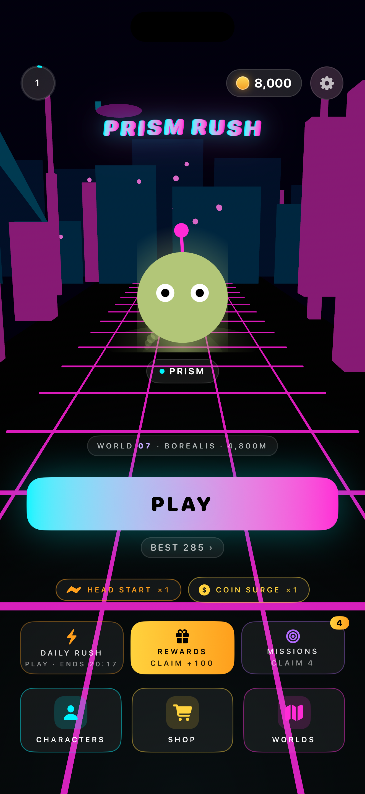<br><sub><b>1 · Hub + loadout</b><br>Gear surfaced, color-coded nav, and the pre-run <b>HEAD START / COIN SURGE</b> loadout chips</sub></td>
<td align="center">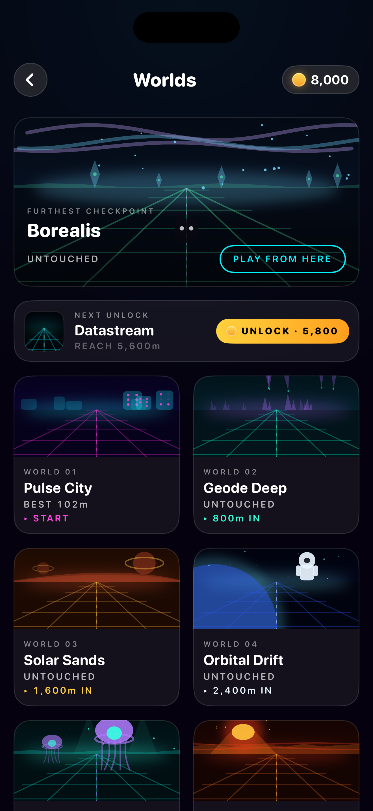<br><sub><b>2 · 12 distinct worlds</b><br>Each its own palette, name & bespoke sky (note Orbital Drift's astronaut)</sub></td>
<td align="center">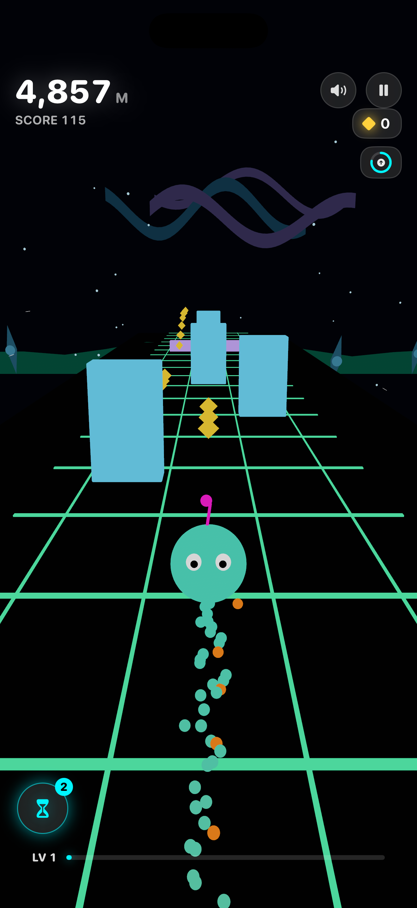<br><sub><b>3 · Super Sneakers</b><br>Higher-jump pickup active — amber feet sparks + HUD timer ring (Borealis aurora)</sub></td>
</tr>
<tr>
<td align="center">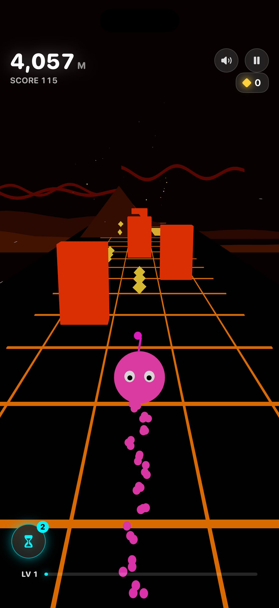<br><sub><b>4 · Ashfall</b><br>One of nine new bespoke worlds — volcano + lava sky, its own dark music bed</sub></td>
<td align="center">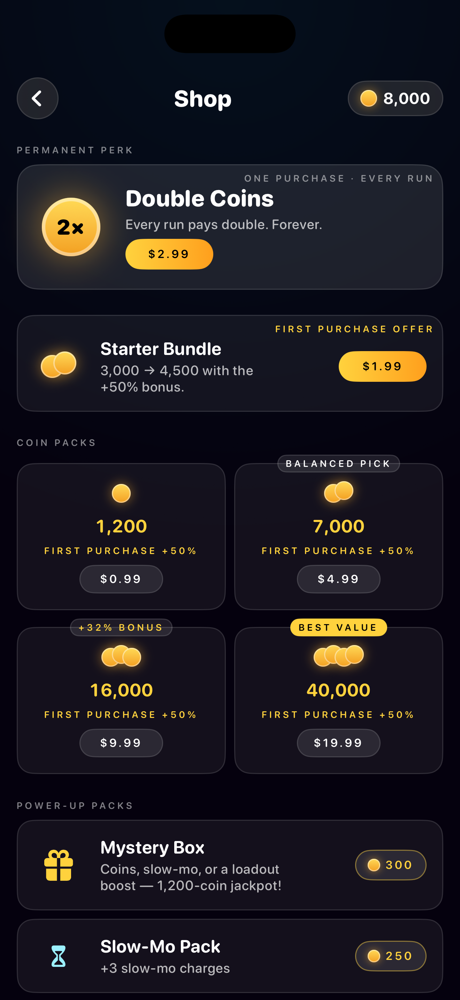<br><sub><b>5 · Power-up packs</b><br>Coin-spend Mystery Box gacha + slow-mo / loadout packs (work in every store state)</sub></td>
<td align="center">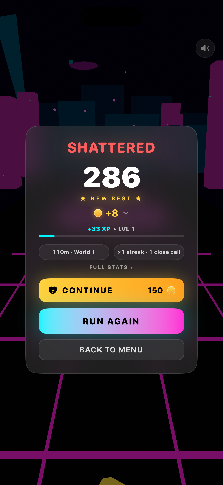<br><sub><b>6 · Run summary</b><br>Meters-primary readout, banded coins + live XP, NEW BEST</sub></td>
</tr>
</table>

The headline engineering decision was making Super Sneakers a real **on-track pickup** without
destabilising the seeded simulation. The Autopilot solvability bot (200 seeds × 6,000 m, zero deaths)
is the contract that gates every spawn change — so the pickup was added by **re-banding pattern 7's
existing single RNG draw** (zero new RNG calls: the obstacle geometry stays byte-identical, only the
*kind* of pickup in a pickup slot shifts), and the higher-jump buff is gated on *collection* — which
the bot never does. Net result: the bot keeps the baseline jump arc it was tuned against, every
ballistic gem-arc/ring placement stays on the base constants, and the only determinism cost is the
expected `DailyChallenge.layoutVersion` 2 → 3 bump (its golden was pre-armed a release in advance).
`reports/shots/v15/` has the raw capture set.

---

## v1.6 — Power-ups, Polish & Progression

A large owner-driven pass, fed by a live play session, that made the meta-game *legible* and the
roster *covetable*. **Subway-style coin routing** — a gem breadcrumb now leads through every gap into
the pattern's safe entry lane, so following the coins is always a takeable route. The **rarity ladder
is finally visible on the characters themselves**: common runners stay plain, rares gain a creature
feature (cat ears / floppy ears / dorsal fin), epics a bold crest (horns / crown), and the four
legendaries a signature crest **plus an orbiting aura ring** — all cosmetic, never an advantage. The
single equipped card became a **swipeable carousel** through all 24 characters, each page showing its
unlock requirement *and a live progress bar*. Power-up icons are now **bespoke procedural glyphs** (no
SF Symbols), shared by the HUD, the corner deploy buttons, and a new **Power-Ups catalog** that
documents every pickup, deploy and pre-run perk. Coin-spend packs get a **reveal burst** on purchase.

Every screenshot is the **actual app on an iPhone 17 Pro Max simulator**, driven through the launch
hooks (`PR_SCREEN` / `PR_FOCUS` / `PR_SKIN` / `PR_AUTOPLAY` / `PR_MYSTERYBOX` / `PR_BUYPACK` / `PR_POWERUPS`).

<table>
<tr>
<td align="center">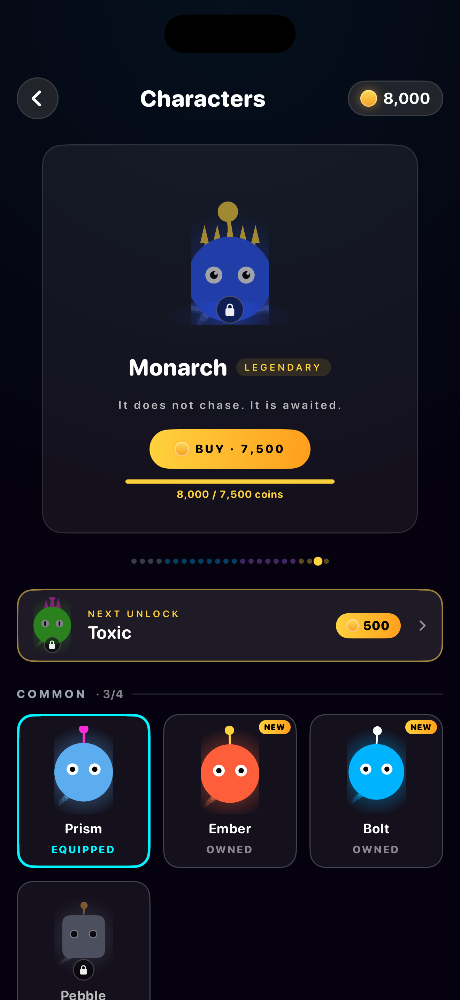<br><sub><b>1 · Character carousel</b><br>Swipe all 24 — crest + rarity dots + a live unlock progress bar (C3)</sub></td>
<td align="center">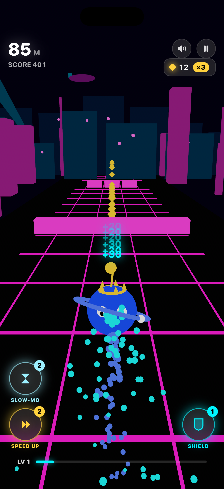<br><sub><b>2 · Legendary in-run</b><br>Monarch's gold crown + orbiting aura on the 3D rig (C2) — previews never lie</sub></td>
<td align="center">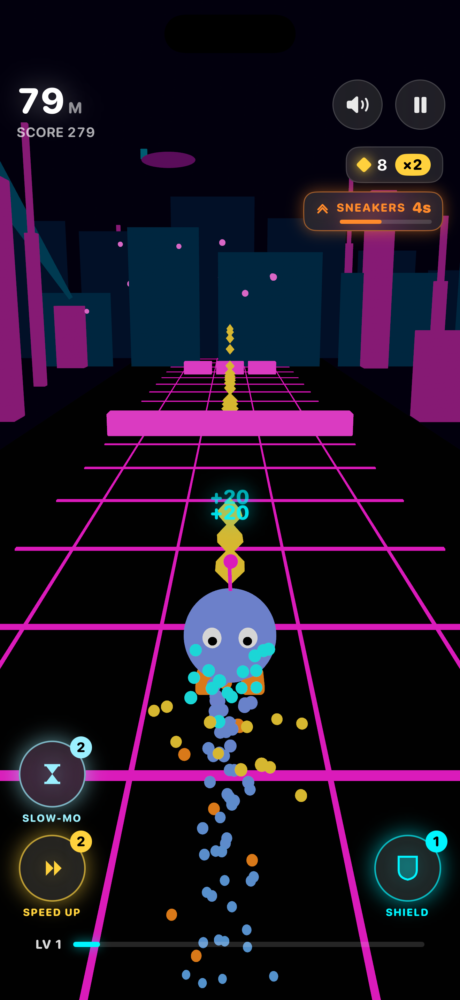<br><sub><b>3 · Bespoke glyphs + coin trail</b><br>Custom power-up icons, thumb-reach deploy buttons, Subway-style coin route (P3/G1)</sub></td>
</tr>
<tr>
<td align="center">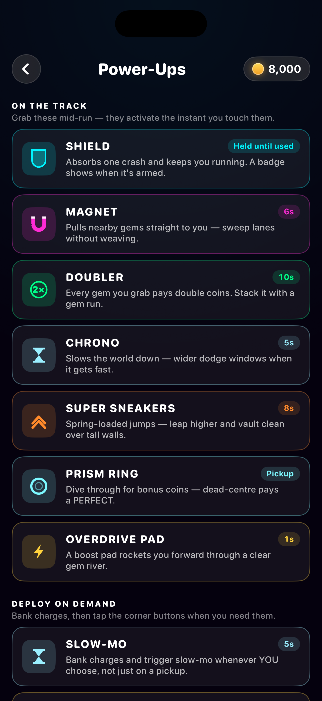<br><sub><b>4 · Power-Ups catalog</b><br>Every pickup, deploy & loadout perk — durations from <code>Tuning</code></sub></td>
<td align="center">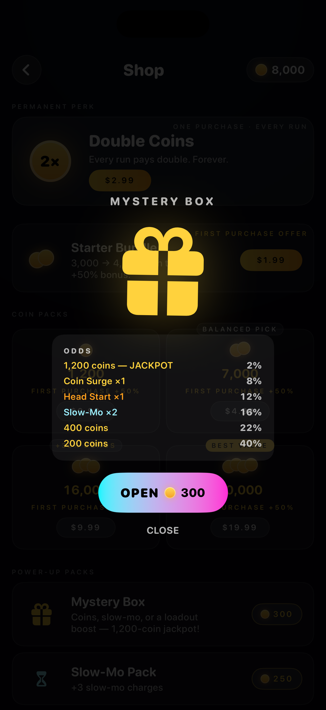<br><sub><b>5 · Mystery Box</b><br>Honest, visible odds (decree 5) + a 1,200-coin jackpot</sub></td>
<td align="center">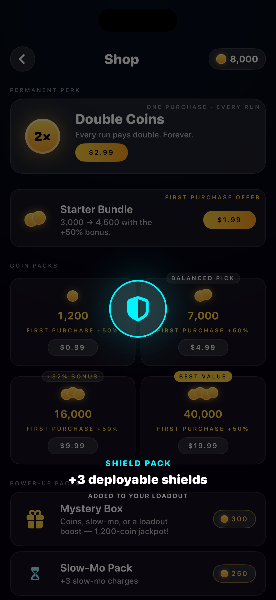<br><sub><b>6 · Pack reveal</b><br>A ring/spark/medallion burst confirms exactly what landed (S1)</sub></td>
</tr>
</table>

The load-bearing engineering decision was **path-aware coin routing without breaking determinism**.
Coins must trace a takeable line, but a naïve centre breadcrumb walks the player into centre obstacles.
The spawner now reads each freshly-built pattern, picks a laterally-safe entry lane (no tall / moving
wall / split-bar cover in the first ~8.5 m), and lays the breadcrumb there — using only the
already-computed spawns and fixed spacing, so it consumes **zero RNG**: the seeded stream and the pinned
`PatternOrderTests` counts are byte-identical. The added gems are still new track entities, so the
shared daily seed reshuffles — the expected `DailyChallenge.layoutVersion` 4 → 5 bump, goldens
re-pinned, with the 200-seed solvability bot and the 12 k-metre deep soak staying green.

---

## Architecture

```
                input (swipe / tap)            SceneEvents.Update (per frame, wall-clock dt)
                       │                                     │
                       ▼                                     ▼
   ┌──────────────────────────────┐   snapshot   ┌────────────────────────────┐
   │  Core/  (pure Swift)          │ ───────────▶ │  Render/  RealityKit        │
   │  • GameCore  (1/120 s tick)   │              │  • RealityRenderer          │
   │  • Spawner + 12 patterns      │   FXEvent    │  • EntityPools (by kind)    │
   │  • Collisions (pure preds)    │ ───────────▶ │  • ProceduralMesh           │
   │  • SplitMix64 RNG (seeded)    │              │  + UI/ SwiftUI HUD/overlays │
   │  • Autopilot (greedy bot)     │              │                            │
   └──────────────────────────────┘              └────────────────────────────┘
        no UIKit / RealityKit imports        RendererPort is the only seam between them
```

- **`Core/`** never imports a renderer; the renderer never owns game state. They meet at one protocol,
  `RendererPort { sync(GameSnapshot); fire(FXEvent) }`. The core hands the renderer an immutable
  per-frame `GameSnapshot` (pooled entity ids, player pose, world-blend, score) and emits one-shot
  `FXEvent`s for juice.
- **Fixed timestep, interpolated render.** `advance(realDt:)` accumulates wall-clock time and steps the
  sim in exact 1/120 s ticks, so physics is identical at 60 Hz or 120 Hz and fully reproducible.
- **Pooling everywhere.** The core caps live entities; the renderer maps stable ids to recycled
  `ModelEntity`s — no per-frame spawn/despawn churn.

```
PrismRush/
  App/      SwiftUI entry + root             Render/Reality/  RealityRenderer, EntityPools, ProceduralMesh
  Core/     GameCore, Spawner, 12 Patterns,  UI/              GameView, HUD, Menu, GameOver, Shop, Missions,
            Tuning, RNG, Collisions,                          DailyChallenge, Settings, HowToPlay, …
            Autopilot, DailyChallenge        Meta/            Profile, ProfileStore, Skin/MissionCatalog
  Audio/    Synth (pure DSP), SynthEngine,   IAP/             IAPCatalog, IAPManager (StoreKit 2)
            Music                            Services/        GameCenter, Account, Haptics
Tests/CoreTests/  163 deterministic tests (most also run on Linux via Package.swift)   UITests/  11 XCUITests
Tools/  build / ci / qa / screenshots / gen_icon
```

---

## Technical deep-dive

**The hardest decision was making the spawner provably solvable instead of hoping it was.** An endless
runner that occasionally spawns an unavoidable wall feels broken, but you can't manually test infinite
procedural content. The fix falls out of the architecture: because the core is deterministic and seed-
driven, "is every pattern survivable?" becomes a *testable* question. A greedy `Autopilot` plays the game
from the core's public state — steer toward the emptiest lane, jump lows, slide/air-slam bars, predict
moving-wall arrival positions — and a unit test runs it across 200 seeds to 6,000 m and asserts **zero
deaths**. Getting there took five trace-driven autopilot fixes, each found by dumping the last ~44 ticks
before a death: a jump's arc spans ~27 units at top speed (so the bot air-slams to recover), a tall still
inside `|z| < 0.95` after passing still blocks its lane (don't drift into a just-passed wall), never cross
*through* a lane whose tall is in its kill band, and stay put unless a threat is actually bearing down.

The alternative — hand-authoring "safe" patterns and eyeballing them — was rejected because it doesn't
scale to the looping difficulty curve and can't catch the emergent cases where two independently-fair
patterns abut at the minimum gap and become a trap. The bot finds those.

Two more details worth calling out: collision logic is extracted into **pure predicates**
(`lowHit`, `barHit`, `gemPickup`, …) so exact boundary thresholds are unit-tested in isolation from the
running sim; and the renderer uses **`UnlitMaterial` exclusively**, which means custom meshes
(octahedron gems, torus magnets, pyramids) need only positions + triangle indices — no normals, no
lighting setup — built at runtime via `MeshDescriptor`.

Everything compiles under **Swift 6 strict concurrency (`complete`)**, including the RealityKit update
loop (the `SceneEvents.Update` handler runs on the main thread but isn't statically isolated, so its body
is wrapped in `MainActor.assumeIsolated`).

---

## Build & run

Requires Xcode 26+, an iOS 18+ simulator, and [`xcodegen`](https://github.com/yonsm/XcodeGen).

```bash
brew install xcodegen
git clone https://github.com/rayancheca/prism-rush-ios
cd prism-rush-ios

./Tools/build.sh        # xcodegen generate + xcodebuild (Simulator)
./Tools/qa.sh           # build → install → launch → screenshot
```

Watch the engine play itself (used for the screenshots above):

```bash
SIMCTL_CHILD_PR_AUTOPLAY=1 xcrun simctl launch booted com.rayancheca.prismrush
```

Run the full test suite — 174 on a Mac (163 unit incl. the 200-seed solvability bot and a 10-seed
12,000 m deep soak, + 11 XCUITest interaction tests):

```bash
xcodebuild test -project PrismRush.xcodeproj -scheme PrismRush \
  -destination 'platform=iOS Simulator,name=iPhone 17 Pro,OS=26.5' CODE_SIGNING_ALLOWED=NO
```

The deterministic core/economy/synth suite also runs anywhere via SwiftPM (no Mac needed — this is
what CI runs on Linux): `swift test -c release`

Device builds / App Store archiving need an Apple Developer **Team ID** in `project.yml`
(`DEVELOPMENT_TEAM`); simulator builds need nothing.

---

## Status

Built phase-by-phase, each gate verified by a real build + on-device screenshot (see `state.md`).

| Phase | | |
|---|---|---|
| 0–1 | Scaffold, contracts, RealityView | ✅ |
| 2 | Deterministic core + tests (26 green, 200-seed bot) | ✅ |
| 3 | Gray-box playable (renderer, input, HUD, menu, game-over) | ✅ |
| 4 | Art pass — 3-world crossfade, per-world decor, character, procedural meshes | ✅ |
| 5 | Juice — pooled particles, screen shake, score popups, world banner, haptics | ✅ |
| 6 | Synthesized 132 bpm synthwave + SFX (AVAudioEngine), best-score/mute persistence | ✅ |

**Free-to-play expansion**

| | | |
|---|---|---|
| E1 | Slide animation (pancake lean + ground dust) | ✅ |
| E2 | Coin economy + `Profile`/`ProfileStore` (UserDefaults + iCloud sync) | ✅ |
| E3 | Menu hub + character select (buy/equip 7 procedural skins) | ✅ |
| E4 | Shop + StoreKit 2 IAP (`Products.storekit` local config) | ✅ |
| E5 | World checkpoints / level select (start from any reached world) | ✅ |
| E6 | Sign in with Apple + Game Center friends leaderboard | ✅ |
| — | **v1.2 multi-agent overhaul** — Linux CI, bug sweep, new content, perf, a11y (see above) | ✅ |
| — | **v1.3 → v1.5** — characters, progression, 12 evolving worlds, the power-up suite (see above) | ✅ |
| — | **v1.6 Power-ups, Polish & Progression** — coin routing, rarity crests + auras, character carousel, bespoke glyphs + catalog, pack reveal | ✅ |
| — | Mac build + visual pass · App Store archive · live IAP/accounts | ⏳ needs your Mac + Apple account |

## Shipping (your Apple Developer account)

Everything above builds, runs and tests on the simulator with no signing. To go live you (the
account holder) do these once — the code is already wired for them. **The full step-by-step,
copy-paste version (exact IAP table, leaderboard settings, privacy answers) is
[`docs/SHIP_CHECKLIST.md`](docs/SHIP_CHECKLIST.md).**

1. **Team ID** → `project.yml` `DEVELOPMENT_TEAM` — ✅ already set (`8M64JJQQAU`).
2. **Capabilities** (Signing & Capabilities, and on developer.apple.com): In-App Purchase, Sign in
   with Apple, Game Center, iCloud (Key-Value storage).
3. **App Store Connect**: create the app record (bundle `com.rayancheca.prismrush`); add the 7 IAP
   products from `Products.storekit`; create leaderboard **`prismrush.best`** and the **recurring
   daily leaderboard `prismrush.daily`** (daily reset — ranks the shared-seed daily challenge);
   check the name "Prism Rush" is available.
4. **App Privacy** answers in ASC now declare data use (Game Center identity, purchases) — no longer
   "Data Not Collected".
5. `xcodebuild archive` + `-exportArchive` (`method: app-store-connect`) and upload.

> Everything you hear is synthesized at runtime with AVAudioEngine — a 132 bpm synthwave bed
> (kick / hi-hat / saw bass / per-world arp) plus every SFX, still zero asset files. Next: soak
> hardening and the App Store archive (icon and metadata are already generated).

<div align="center"><sub>Built with Claude Code. No third-party runtime dependencies.</sub></div>
